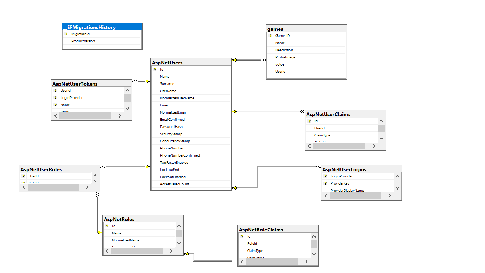

La estructura del projecto esta realizada en base a les demandas de la practica. La estructura en el front end puede ser un poco diferente.

En quanto a las estructura de la aplicacion entras en home(index) y alli veras los juegos ordenados con mayor voto delante. Si no esta iniciado tendras arriba las opciones de iniciar sesion y registrarte. Si inicias sesion con un user te saldran las diferentes opciones:
    -home
    -chat
    -cerrar Sesion
    -dentro de las ventanas de los juego te saldra la opcion de votar.
Si entras como admin te saldran:
    -home
    -crear Juego
    -Registrar Admin(tienes el poder de registrar a otros administradores)
    -chat
    -Cerrar Sesion
He creado este sistema de admin asi porque me parecia mas seguro, no solo si no tienes los tokens y credenciales no podras iniciar el tramite sino que si  no lo eres tampoco te saldran las opciones.

Prompos Usados por ia:
